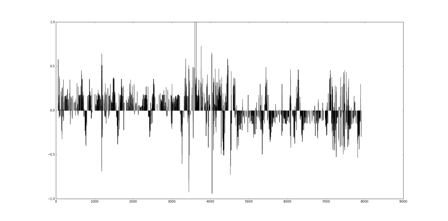
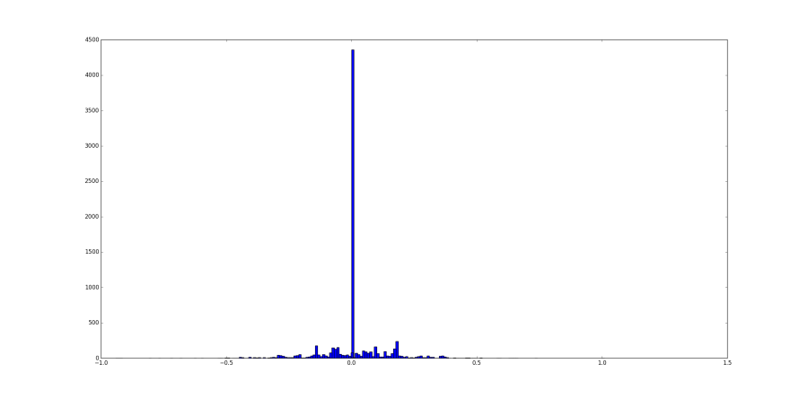
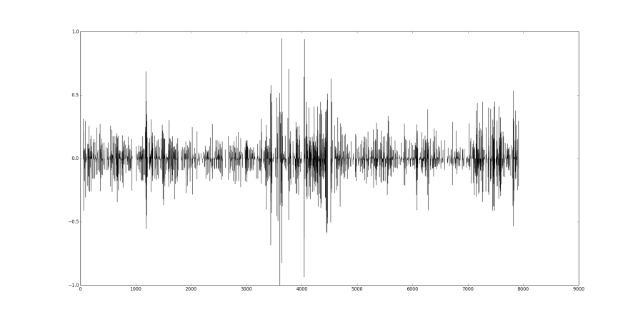
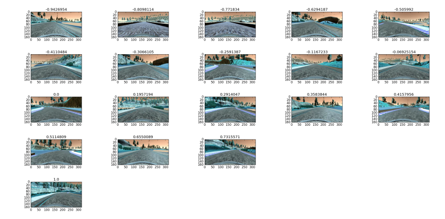
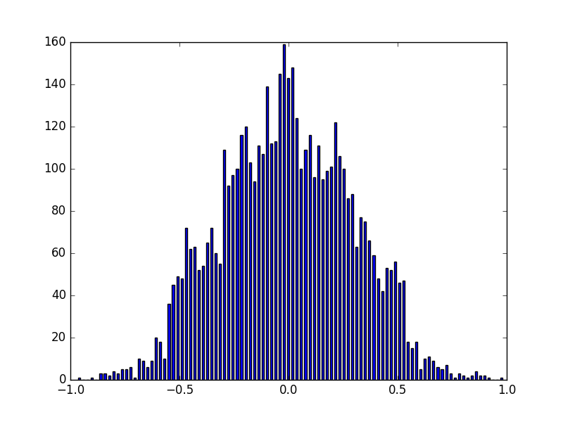
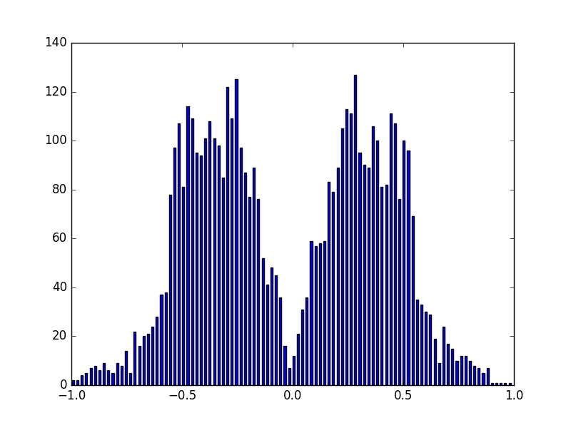
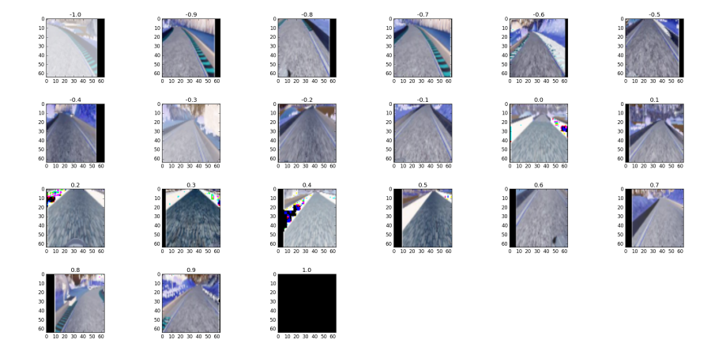

# CarND-BehavioralCloning-P3

Repository to document the Behavioral Cloning project of the Udacity's
self driving car nanodegree

## Data
As with all machine learning problems, the predominant part of the
problem turned out to be getting the right data. This project is
extremely true to the phrase; "Garbage In, Garbage Out".

### Data source
#### My own data
Collecting data on my own was tortuously difficult considering that my
choices were limited between a keyboard or a steam controller. I
struggled fruitlessly for over a week to collect the data (although,
I've to admit that playing with the simulator was a lot of fun to
begin with). But this gave me a change to understand just how important
the process of collecting the data is. The problems with my data were
the following

* Too many entries of 0
* Keyboard driving angles were too quantized given me huge gradients
whenever there was a big turn
* I kept goofing up collecting recovery data.

Finally came the savior.

#### Udacity data
Udacity released their data on Track 1 couple of weeks back and this
really jump started this project for me. I started with an approach
similar to the TSR project, by visualizing the dataset to get an
intuition of the dataset

##### Angles over time
The first was to see how the angles vary over time



##### Angle distribution
Now the important thing to find how the angles are distributed. We know
that steering models, due to the large availability of 0s on the datasets
typically tend to be biased towards predicting 0s.



And we can see that it holds good for this dataset as well. HUGE number of
0s and very very few of all other data. This is definitely going to bias
our model towards predicting 0s, if we go ahead as it is.

##### Angle difference
Let's also see, if we've big jumps in the angles over time (like it would
if the data were to be recorded via keyboard). Note that recording from
an actual steering wheel, we can expect the angle difference between
subsequent samples to be quite uniform.



We can see that sometimes there are pretty large spikes in the difference.
This points that the data has a good volatility in it and it's going to
be difficult for the model to get a smooth output from it.

##### Sample images
Finally, let's plot some sample images from the data for each angle bin.
I'm just splitting all the angles into 21 bins of 0.1 size.



We can see that the some of the images, don't really make too much
sense. For eg:. the -0.8 and the -0.7 images taken at the bridge looks
like the car is well centered, and yet we've a very large angle. So the
dataset has quite a large amount of errors, so we need to think of a
way to offset this error.

### Data Augmentation
As with the TSR project, along with some of the excellent discussions
in the slack channel with Vivek and John, I came to the conclusion that
data augmentation was the way to clean up the data. So the following are
the augmentation that I do on the data set

#### Randomly choosing between left, center or right image
Choose images randomly between left, right or center images by doing
the following. The approach is to add / subtract a static offset from
the angle when choosing the left / right image. To get a smoother drive,
we can add / subtract an offset that's weighted by the magnitude of the
angle. But this biases the model towards 0s again and is a design
tradeoff. I chose the simple static offsets.
```python
img_choice = np.random.randint(3)

if img_choice == 0:
    img_path = os.path.join(PATH, df.left.iloc[idx].strip())
    angle += OFF_CENTER_IMG
elif img_choice == 1:
    img_path = os.path.join(PATH, df.center.iloc[idx].strip())
else:
    img_path = os.path.join(PATH, df.right.iloc[idx].strip())
    angle -= OFF_CENTER_IMG
```

#### Flipping the image
This is the easiest and here I just flip the image on it's vertical
axis and invert the sign of the angle. And I do this randomly
```python
if np.random.randint(2) == 0:
    img = np.fliplr(img)
    new_angle = -new_angle
```

#### Changing brightness
This is similar to what Vivek does, i've just made it more generic and
configurable via a macro. I've set it to .25 for this training.
```python
temp = cv2.cvtColor(img, cv2.COLOR_BGR2HSV)

# Compute a random brightness value and apply to the image
brightness = BRIGHTNESS_RANGE + np.random.uniform()
temp[:, :, 2] = temp[:, :, 2] * brightness

# Convert back to RGB and return
return cv2.cvtColor(temp, cv2.COLOR_HSV2RGB)
```

#### Changing X and Y translation
This is also similar to what Vivek does and i've just made it generalized.
This is to simulate drifting of the car and it's correction back beyond
what the left and the right camera images allow us.
```python
# Compute X translation
x_translation = (TRANS_X_RANGE * np.random.uniform()) - (TRANS_X_RANGE / 2)
new_angle = angle + ((x_translation / TRANS_X_RANGE) * 2) * TRANS_ANGLE

# Randomly compute a Y translation
y_translation = (TRANS_Y_RANGE * np.random.uniform()) - (TRANS_Y_RANGE / 2)

# Form the translation matrix
translation_matrix = np.float32([[1, 0, x_translation], [0, 1, y_translation]])

# Translate the image
return cv2.warpAffine(img, translation_matrix, (img.shape[1], img.shape[0]))
````

#### Biasing towards non-0 value
From the original dataset, we know that we need to ensure that the model
does not get biased towards predicting a close to 0 angle. To do this,
we use a bias term as input to the data_generator. We tweak this bias
term at the end of each epoch to decreasing the probability that a small
angle will be selected for training. It goes like this
```python
# Choose left / right / center image and compute new angle
# Do translation and modify the angle again

# Define a random threshold for each image taken
threshold = np.random.uniform()

# If the newly augmented angle + the bias falls below the threshold
# then discard this angle / img combination and look again
if (abs(angle) + bias) < threshold:
    return None, None
```
What this will accomplish is that as we decreases bias from 1.0 to 0.0,
it'll with increasing probability drop all the lower angles. Note that
we do not set a hard threshold for low angles, but allow it to drop off
uniformly.

#### Data Preprocessing
We also pre-process the data by removing the top 60 pixels (past the
horizon) and the bottom 15 pixels (the hood of the car). And we resize
the resulting image to a 64x64 (makes the CNN work much easier when it's
a square image).
```python
# Remove the unwanted top scene and retain only the track
roi = img[60:140, :, :]

# Resize the image
resize = cv2.resize(roi, (IMG_ROWS, IMG_COLS), interpolation=cv2.INTER_AREA)

# Return the image sized as a 4D array
return np.resize(resize, (1, IMG_ROWS, IMG_COLS, IMG_CH))
```

#### Visualizing data after the augmentation
So let's see what impact we've made on the data.

**Bias 1.0**



**Bias 0.0**



You can see that the when we allow a bias of 1.0,
the data is nicely guassian shaped, but as we reduce bias to 0.0, the 0
angle data is severely punished allowing our model to incrementally
learn a more complex hypothesis.

We can also plot some of the images to see how the images look post
augmentation. We can see that we've got a variety of images spanning
a larger histogram of angles covering shifts, etc...



## Model
I iterated through multiple models, and these were my progression

* Simple 2 ConvNets with MaxPool, Relu and then 2 FC layers
* Comma ai model
* nVidia model
* VGG16 pretrained model

I've finally latched onto a slightly simplified version of the VGG16
pre-trained model.

| Layer (type)                    |     Output Shape    | Param # | Trainable |
|---------------------------------|---------------------|---------|-----------|
| lambda_1 (Lambda)               | (None, 64, 64, 3)   | 0       | Yes       |
| color_conv (Convolution2D)      | (None, 64, 64, 3)   | 12      | Yes       |
| block1_conv1 (Convolution2D)    | (None, 64, 64, 64)  | 1792    | No        |
| block1_conv2 (Convolution2D)    | (None, 64, 64, 64)  | 36928   | No        |
| block1_pool (MaxPooling2D)      | (None, 32, 32, 64)  | 0       | No        |
| block2_conv1 (Convolution2D)    | (None, 32, 32, 128) | 73856   | No        |
| block2_conv2 (Convolution2D)    | (None, 32, 32, 128) | 147584  | No        |
| block2_pool (MaxPooling2D)      | (None, 16, 16, 128) | 0       | No        |
| block3_conv1 (Convolution2D)    | (None, 16, 16, 256) | 295168  | No        |
| block3_conv2 (Convolution2D)    | (None, 16, 16, 256) | 590080  | No        |
| block3_conv3 (Convolution2D)    | (None, 16, 16, 256) | 590080  | No        |
| block3_pool (MaxPooling2D)      | (None, 8, 8, 256)   | 0       | No        |
| block4_conv1 (Convolution2D)    | (None, 8, 8, 512)   | 1180160 | Yes       |
| block4_conv2 (Convolution2D)    | (None, 8, 8, 512)   | 2359808 | Yes       |
| block4_conv3 (Convolution2D)    | (None, 8, 8, 512)   | 2359808 | Yes       |
| block4_pool (MaxPooling2D)      | (None, 4, 4, 512)   | 0       | Yes       |
| block5_conv1 (Convolution2D)    | (None, 4, 4, 512)   | 2359808 | Yes       |
| block5_conv2 (Convolution2D)    | (None, 4, 4, 512)   | 2359808 | Yes       |
| block5_conv3 (Convolution2D)    | (None, 4, 4, 512)   | 2359808 | Yes       |
| block5_pool (MaxPooling2D)      | (None, 2, 2, 512)   | 0       | Yes       |
| Flatten (Flatten)               | (None, 2048)        | 0       | Yes       |
| fc1 (Dense)                     | (None, 1024)        | 2098176 | Yes       |
| fc1_dropout (Dropout)           | (None, 1024)        | 0       | Yes       |
| fc2 (Dense)                     | (None, 256)         | 262400  | Yes       |
| fc2_dropout (Dropout)           | (None, 256)         | 0       | Yes       |
| fc3 (Dense)                     | (None, 128)         | 32896   | Yes       |
| fc3_dropout (Dropout)           | (None, 128)         | 0       | Yes       |
| fc4 (Dense)                     | (None, 64)          | 8256    | Yes       |
| fc4_dropout (Dropout)           | (None, 64)          | 0       | Yes       |
| fc5 (Dense)                     | (None, 32)          | 2080    | Yes       |
| fc5_dropout (Dropout)           | (None, 32)          | 0       | Yes       |
| output (Dense)                  | (None, 1)           | 33      | Yes       |
**Total params:** 17118541

Things to note are

* I've added a lambda layer on the top similar to the comma ai model to
normalize the data on the fly
```python
model.add(Lambda(lambda x: x/127.5 - .5,
                 input_shape=(IMG_ROWS, IMG_COLS, IMG_CH),
                 output_shape=(IMG_ROWS, IMG_COLS, IMG_CH)))
```
* I've added a color space conversion layer (credit to Vivek for the
brilliant idea) as the first layer, so the model can automatically
figure out the best color space for the hypothesis
```python
model.add(Convolution2D(3, 1, 1, border_mode='same', name='color_conv'))
```
* The remaining convolutional layers are directly taken from VGG16
* I've added 5 fully connected layers in decreasing complexity as the classifier
* I load the pre-trained no-top weights for the VGG16.
* I ensure that the top 3 conv blocks from VGG16 are frozen and the other layers are trainable.

### Regularization
We take care of regularization in three ways

* We augment the data heavily. This more than anything else allows the
model to generalize.
* We add dropouts in all the fully connected layers.
* We split the training set to training and cross validation to control
the number of epochs in training. We split a small size (BATCH size) of
data as validation data and use that to control if we are acutely
overfitting the data

Overall, my impression in this project has been that considering the
noise in the data and the complexity of the hypothesis, conventional
methods of looking primarily at loss is ineffective at curbing overfitting.

There is no reason for a test set, since we can test directly by allowing
the car to drive.

## Training
* **Generator**: In this training, we use a generator (inspired again
from Vivek), which randomly samples the set of available images (including left and right)
from the CSV file, randomly flips it, randomly changes brightness, randomly
translates it in the X and Y direction (also changing the angle) and
pre-processes the images and feeds to the model. This is great because
keras ensures that while the GPUs are busy training the model, the CPU
can in parallel generate the data using the generator.
* **Optimizer**: Adam with a learning rate of 1e-5. This was emperically
noted as we are transfer learning (fine tuning an existing model).
* **Bias**: We start with a bias of 1.0 (allow all angles) and slowly
as the epochs continue, reduce the bias, thereby dropping low angles
progressively.
```python
bias = 1. / (num_runs + 1.)
```
* **Predictions**: Sometimes the model had a tendancy to predict a constant output. I print out a set of predictions to ensure that the model was not converging to a single value during training.

## Driving
During driving, one observation was that the model (because of my intent
to smoothen the drive) does not take sharp curves at good speeds. I had
two choices, one was to slow down during curves and the other was to
multiply the predicted angle by a constant. Both approaches are used
here to obtain a clean drive through Track 2. Track one was able to run without the above modifications

### Track 1
The model worked directly on track 1 with no changes.

<a href="http://www.youtube.com/watch?feature=player_embedded&v=OG080eLUAkQ" target="_blank"></a>

Note that towards the end, where the two shadow lines (electrical wires) come, the car turns oddly. This suggests that the model is very afraid of shadows.

### Track 2
In lieu of Track 1 results, it was impossible to run the model on Track 2 with shadows enabled. So decreasing the quality to 'fastest', and increasing the throttle to 0.3 and multiplying the predicted steering angle by 1.4, we get

<a href="http://www.youtube.com/watch?feature=player_embedded&v=gevcOvQnhGk" target="_blank"></a>

Considering the amount of turns, and steep inclines, the model does spectacularly well.

## Reflections
I've just got an incredible amount of respect for the people developing
self driving cars. This is one of the most challenging assignments that
I've done in my professional life. The dependancy on data, hyper
parameters and the various other entities forces the developer to have
a very streamlined process of development, without which the development
will easily fall apart. I cannot thank enough all the wonderful help
that I received and the discussions I had with my class mates on slack
and confluence.

## Future work
* Incorporate augmented shadows in the training to make it more robust
* Look at the models used in the Challenge-2, especially optical flow
and lstm based (I've always loved the idea of RNNs)
* See how well a simulator learned model works on real world data
* Incorporate advanced lane findings (P4) and object detection (P5) into
this project for a complete steering solution
* Add another output for throttle and let the model automatically
control it.

## Acknowledgements
* [Vivek's wonderful post on data augmentation](https://chatbotslife.com/using-augmentation-to-mimic-human-driving-496b569760a9)
* [NVidia's paper on end-to-end training](https://arxiv.org/pdf/1604.07316v1.pdf)
* [Comma.ai's steering model](https://github.com/commaai/research/blob/master/view_steering_model.py)
* [VGG16 paper](https://arxiv.org/pdf/1409.1556.pdf)
* [VGG16 model from keras](https://github.com/fchollet/keras/blob/master/keras/applications/vgg16.py)
