# Vehicle Detection Project

The goals / steps of this project are the following:

* Perform a Histogram of Oriented Gradients (HOG) feature extraction on a labeled training set of images and train a classifier Linear SVM classifier
* Optionally, you can also apply a color transform and append binned color features, as well as histograms of color, to your HOG feature vector.
* Note: for those first two steps don't forget to normalize your features and randomize a selection for training and testing.
* Implement a sliding-window technique and use your trained classifier to search for vehicles in images.
* Run your pipeline on a video stream (start with the test_video.mp4 and later implement on full project_video.mp4) and create a heat map of recurring detections frame by frame to reject outliers and follow detected vehicles.
* Estimate a bounding box for vehicles detected.

## Software Overview
The software is partitioned into 3 critical python sources.

 1. **train.py**

   This contains all the necessary code to extract the features of the images, and then to train the SVM. To do this in an easy manner, I've abstracted
   all the configurations as a dictionary called parameters that's initialized in the begining of train.py. By modifying this, we can try out different
   results.

   Also to speed up the process, train.py will save the extracted features into a `features.pickle` and then the trained svm also into a `svc.pickle`
   file. The `features.pickle` is not saved to the repository due to space constraints. But the `svc.pickle` file is saved and can be used to directly
   run the classifier on test images for prediction. The pickle files also save the parameters so they can be used to generate corresponding test
   features during testing.

 2. **process.py**

    This file is responsible for being able to run the classifier on a test image / video and generate a corresponding output. It reuses the `svc.pickle`
    file that was saved earlier (so that file should be in the folder before this file is run). Once the pickle is loaded, we can also extract the
    parameters from the pickle that was used during training. The file then generates the same features that were used during training for the test
    images and then attempts to classify objects using a sliding window approach.

 3. **utils.py**

    This file contains all utility functions such as hog, spatial binning, etc... that is used by both the train.py and process.py.

## [Rubric](https://review.udacity.com/#!/rubrics/513/view) Points
Here I will consider the rubric points individually and describe how I addressed each point in my implementation.

---

### Writeup / README

#### 1. Provide a Writeup / README that includes all the rubric points and how you addressed each one.  You can submit your writeup as markdown or pdf.  [Here](https://github.com/udacity/CarND-Vehicle-Detection/blob/master/writeup_template.md) is a template writeup for this project you can use as a guide and a starting point.

You're reading it!

### Visualizing the data
I started by reading in all the `vehicle` and `non-vehicle` images.
Here is an example of some of `vehicle` and `non-vehicle` classes:

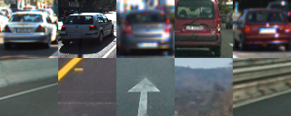

### Image Features
Just like a DNN, selecting the features is like tuning hyper-parameters
of a neural-net. I spent time running each of the combinations to see
what works. The options that I had were

 * Spatial binning (features directly extracted from the image pixels)
   * Color space of the image (commonly used for other features too)
   * Size of the image to be binned
 * Color histogram
   * Number of histogram bins
 * Histogram of oriented gradients
   * Channel used
   * Orientations
   * Pixels per Cells
   * Cells per block

#### Choosing the parameters
I first spent time visualizing the various features extracted with the
various options to see which made the most difference visually.

##### Spatial Binning
Here, the choice is simply just based on the speed, as obviously more
is better with the max being (64, 64). I've chosen **(16, 16)** to
optimize for speed.

Refer to `_get_spatial_features` in `utils.py` for the code.

##### Color Histogram
Here, the color space is the biggest factor and to a lesser extent the
number of bins. Here are some experimental results.

**RBG Histogram**

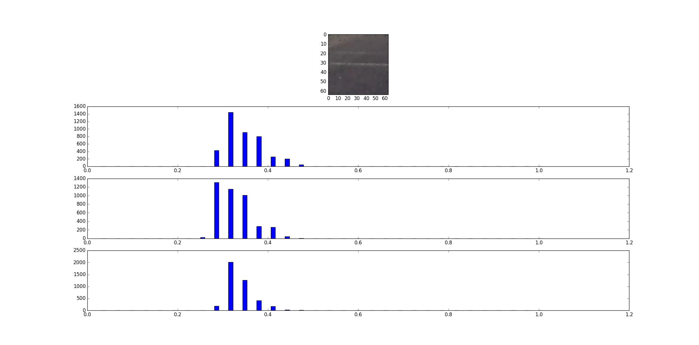

**YCbCr Histogram**
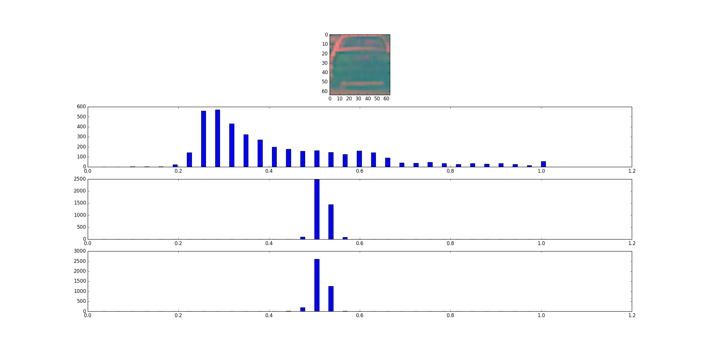
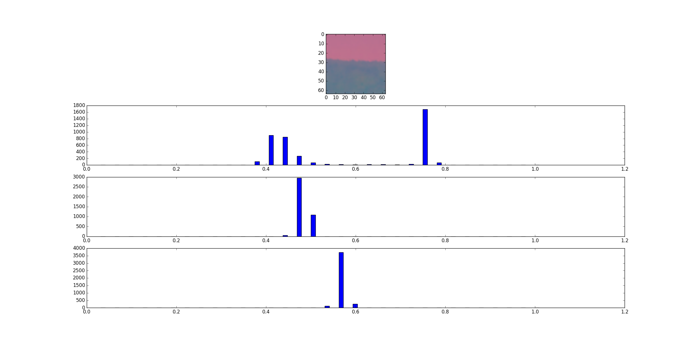

**HSV Histogram**
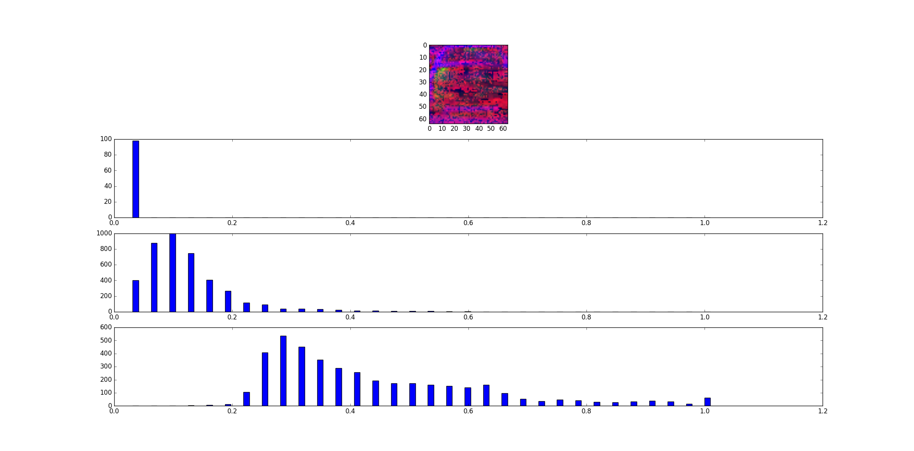
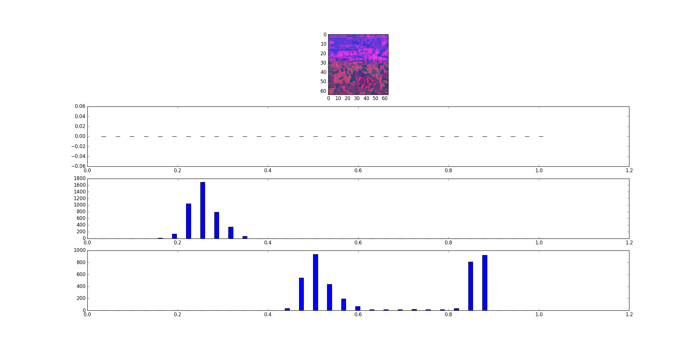

We can see that both RGB and HSV show big variations along with the Y
channel in the YCbCr. Let's reserve the choice on the color space till
we see the performance of the HOG which is the critical feature.

At this moment, I felt that **16 bins** is a good parameter to go, again
considering speed.

Refer to `_get_color_features` in `utils.py` for the code.

#### Histogram of Oriented Gradients (HOG)

##### 1. Explain how (and identify where in your code) you extracted HOG features from the training images.

The code for this step is contained in `_get_hog_features` function in
`utils.py`. This is invoked by `_extract_img_features` function also in
`utils.py`, which is ultimately invoked in `train.py` during the feature
extraction

##### 2. Explain how you settled on your final choice of HOG parameters.
Once again the first step in choosing the parameters is to visualize how
the various combinations look. So here goes.

**Orientations, Pixels per cell and Cells per block**

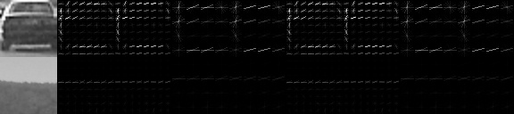

The combinations used here are

 1. Orientations = 8, Pixel per cell = (8,8), cells per block = 2
 2. Orientations = 9, Pixel per cell = (8,8), cells per block = 2
 3. Orientations = 8, Pixel per cell = (16,16), cells per block = 2
 4. Orientations = 9, Pixel per cell = (16,16), cells per block = 2
 5. Orientations = 8, Pixel per cell = (8,8), cells per block = 1
 6. Orientations = 9, Pixel per cell = (8,8), cells per block = 1
 7. Orientations = 8, Pixel per cell = (16,16), cells per block = 1
 8. Orientations = 9, Pixel per cell = (16,16), cells per block = 1

We can see that (at least visually), the first option seem quite dashing
with minimum parameter values. So I've gone with the various of
**Orientations = 8, Pixel per cell = (8,8), cells per block = 2**

The next major decision is the color space. In the previous project
(P3 behavioural cloing), I used a 1x3 convolutional operator at the
beginning, to allow the model to figure out it's own perfect color space.
Unfortunately, we do not have that
luxury here.We know from the histogram
experiment that HSV and RGB are good options because of their diverse
nature. So next round of visualizations

**YCbCr HOG**

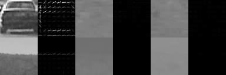

**RGB HOG**

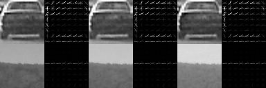

**HSV HOG**

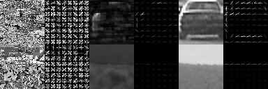

So once again all the 3 RGB channels show a good difference between
cars and non-cars. So too does the S and V channel of HSV. Let's train
the classifier and look at it's score before finalizing on the color-
space.

Refer to `_get_hog_features` in `utils.py` for the corresponding code.

#### 3. Describe how (and identify where in your code) you trained a classifier using your selected HOG features (and color features if you used them).
I trained the classifier on multiple feature combinations to find out
the best option in terms of accuracy and time and these were the results.

| Color Space | Spatial_size | Color_hist_bins | hog_channel | hog_cell_per_block | hog_orientations | hog_pix_per_cell	| Num. Features | Test Score | Test time |
| --- | --- | --- | --- | --- | --- | --- | --- | --- | --- |
| YCbCr | NA | NA | 0 | 8 | 8 | 2 | 1568 | 93.53% | 0.03506 |
| RGB |	NA | NA | 0, 1, 2 | 8 | 8 | 2 | 4704 | 96.07% | 0.029842 |
| HSV |	NA | NA | 1, 2 | 8 | 8 | 2 | 3136 | 95.97% | 0.021251 |
| HSV |	16, 16 | 16 | 1, 2 | 8 | 8 | 2 | 3952 | **98.51%** | **0.0252** |
| HSV |	16, 16 | 16 | 0, 1, 2 | 8 | 8 | 2 | 5520 | **98.86%** | 0.033563 |
| RGB | 16, 16 | 16 | 0, 1, 2 | 8 | 8 | 2 | 5520 | 97.73% | 0.034383 |

So the best option was the following combination with respect to time
and accuracy was to go with the S and V channel of HSV to get 98.5%
accuracy and pretty fast test time. This will also significantly reduce
the feature extraction time (by about 1/3).

Refer to `process_features` in `train.py` for the final chosen parameters

### Software flow

Let me take a moment to describe the software flow at this point. The
train.py is initially run with the images stored under `./data` directory.
The train.py module will scan if a features.pickle and a svc.pickle
already exists. If it does, it allows the user to choose to reuse the
pickle data or to generate new and overwrite the pickle data.

The train.py first extract features from the training images based on
the parameters chosen and then saves the features along with the
parameters in `features.pickle`

Then train.py trains a classifier using `LinearSVC` for a maximum of
20k iterations. One observation is that when we add the spatial and
color histogram, the training time **drastically** reduces. By order of
50 times. I assume that the new features enables the SVC to find a
hyperplane more easily.

### Sliding Window Search

#### 1. Describe how (and identify where in your code) you implemented a sliding window search.  How did you decide what scales to search and how much to overlap windows?

The sliding window search contains 3 different scales of windows

| Scale | Start Y | End Y | Overlap | Num Windows |
| --- | --- | --- | --- | --- |
| 96 | 400 | 500 | 0.75 | 156 |
| 144 | 400 | 500 | 0.75 | 34 |
| 192 | 430 | 550 | 0.75 | 25 |
| 192 | 460 | 580 | 0.75 | 25 |

That's a total of 240 sliding windows!

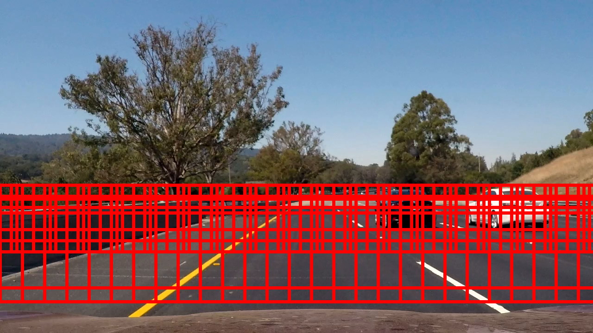

#### 2. Show some examples of test images to demonstrate how your pipeline is working.  What did you do to try to minimize false positives and reliably detect cars?

This is where it get's interesting. We get a lot of false positives when
we actually test the images. For some reason, lane lines are almost
always detected as cars. I took few steps here to reduce the false
positives

 1. Hard negative mining: Took some images from the test images that
 were wrongly marked as cars and placed them in the non-car bin to ensure
 that they aren't selected as cars. This did not have too much of an
 impact.

 2. Use of decision function instead of pred. This has a big impact and
 using a threshold on the decision function was hugely beneficial.

 3. Generating and thresholding the heatmap to combine the detection
 window into a single detection window.

Some images from the test images

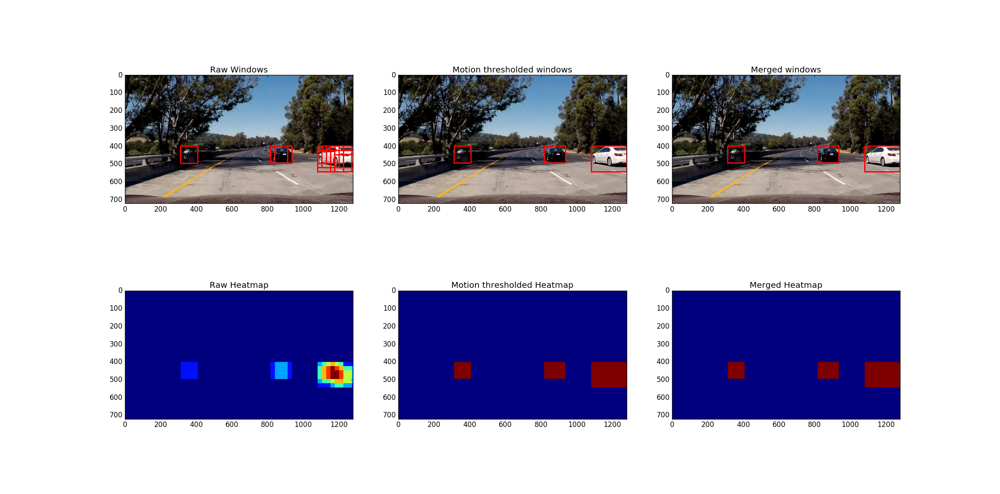

More images can be seen in the `output_images` folder.

The code for this can be seen in the `process` function of the `Detector`
class in `process.py`

---

### Video Implementation

#### 1. Provide a link to your final video output.  Your pipeline should perform reasonably well on the entire project video (somewhat wobbly or unstable bounding boxes are ok as long as you are identifying the vehicles most of the time with minimal false positives.)
Here's a [link to my video result](./project_video.mp4)

#### 2. Describe how (and identify where in your code) you implemented some kind of filter for false positives and some method for combining overlapping bounding boxes.

Here, I take two approaches to reducing false positives (yet some slip
through).

 1. I combine the heatmaps of a set of 5 recent frames (maintained via
 a circular buffer) and then do a joint threshold of the combined
 heatmap. This is kinda like a motion blurring and I used a similar
 strategy to good effect in the advanced lane project. This on it's own
 gives a pretty good reduction in false positives on the video. Refer
 to `blur_frames` function in `process.py`

 2. The second part is more complicated. This is mainly to reduce the
 wobblyness of the detections in the video. Here I try and find the
 centers and radius of each of the boxes. And then try to maintain a
 motion computation of each of the boxes across frames. This way, I
 average out the box radius and the centers so as to ensure that the
 detections don't wobble too much. Refer to `blur_boxes` function in
 `process.py`

### Here are six frames and their corresponding heatmaps:

The sequence in each image is

 1. The original image
 2. Raw windows directly obtained from the sliding window
 3. Heat map corresponding to the raw windows
 4. Motion blurred windows (computed using `blur_frames`)
 5. Motion blurred heatmap
 6. Box averaged windows (Computed using `blur_boxes`)
 7. Box averaged heatmap

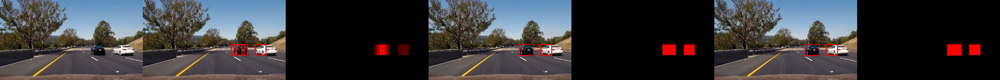
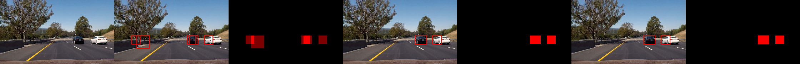
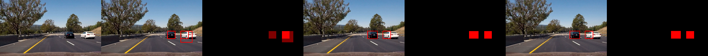

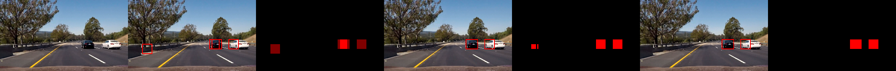

We can see that the double averaging safely discards some of the false
positives even though as a single image, it would have been impossible
to discard them.

---

### Discussion

#### 1. Briefly discuss any problems / issues you faced in your implementation of this project.  Where will your pipeline likely fail?  What could you do to make it more robust?

Multiple points to discuss here

**Where will the pipeline fail**
 1. Well pretty much everywhere which is not this video. The training
 image set is hardly capable of working on a generalized model and I
 don't think HOG + SVM is sufficiently capable enough to detect cars well.
 But I also know that with more redundancy, multiple live automotive
 systems use HOG + SVM as a working production code. My company has in
 the past used HOG + SVM for pedestrian detection and had a pretty
 decent solution. So with enough diverse dataset, and with more
 intelligent post processing, it's definitely possible to make this
 generic.

**Making it robust**
 1. Most certainly adding more diverse training data.
 2. Move to DNNs and try region proposal networks (this should significantly
 increase speed as well)
 3. More intelligent vehicle tracking by instantiating vechicles and
 maintaining a state machine for them with confidence, etc... It's
 definitely possible to improve the detection rate as well as reducing
 false positives with that.
 4. Reduce the search space for the sliding window by searching only at
 the entry and exit points beyond the already found cars. This way we
 will have only a very limited set of sliding windows to search.
 5. Another idea is, once a car is "locked", we can use simple template
 matching to keep finding that car and need not use a full sliding
 window approach.
 6. Try other features such as Haar, MOG and see their relative
 performance.

